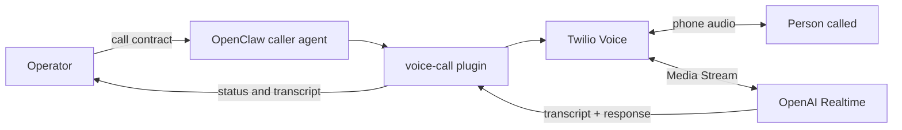

# Voice AI Caller

A task-scoped, bilingual phone agent for real outbound conversations. It combines [OpenClaw](https://github.com/openclaw/openclaw), Twilio Programmable Voice, and OpenAI Realtime.

The agent can call a business, follow a narrow contract, handle short branches, ask for missing details, and return a transcript-backed result. Each call starts in an isolated session and has no access to the operator's personal assistant memory.

> Status: live-tested prototype. This repository is a sanitized integration template, not a hosted service or an SLA-backed production system.

## Features

- Natural two-way voice through OpenAI Realtime
- German by default, Russian when explicitly requested
- Barge-in support and server-side voice activity detection
- Per-call context isolation
- Explicit call contracts with hard limits and an end condition
- Truthful automated-assistant disclosure when asked
- Signed Twilio webhooks
- Inbound calls disabled by default
- Recording disabled unless a destination is explicitly allowlisted
- Offline mock configuration for safe testing

## Architecture



## What is in this repository

This project does not copy or repackage the OpenClaw voice-call plugin. It provides the integration layer around the official package:

- a hardened caller policy;
- mock and Twilio/OpenAI configuration examples;
- reusable call-contract examples;
- security guidance;
- an offline validator that checks structure and scans for common secret leaks.

## Requirements

- Node.js 20 or newer
- A current OpenClaw installation
- `@openclaw/voice-call` version `2026.7.1` or a compatible newer version
- Twilio account and an approved outbound number
- OpenAI Platform API key with Realtime access
- A public HTTPS/WSS endpoint for Twilio webhooks and Media Streams

## Quick start

### 1. Install the official plugin

```bash
openclaw plugins install @openclaw/voice-call@2026.7.1
```

### 2. Start with mock mode

Merge [`config/voice-call.mock.example.json`](config/voice-call.mock.example.json) into your OpenClaw configuration, then run:

```bash
openclaw config validate
openclaw voicecall setup --json
```

Mock mode creates no external phone call.

### 3. Prepare credentials outside the repository

Use [`.env.example`](.env.example) only as a list of required variables. Store real values in the Gateway process environment, a secret manager, or the global OpenClaw environment file at `~/.openclaw/.env`.

Do not store provider credentials in this repository's workspace `.env`. OpenClaw intentionally ignores protected provider credentials from lower-trust workspace `.env` files.

### 4. Add the caller policy

Create a dedicated OpenClaw agent workspace for calls and use [`agent/AGENTS.md`](agent/AGENTS.md) as its task policy. Keep memory search and unrelated tools disabled for that agent.

### 5. Enable Twilio + Realtime

Merge [`config/voice-call.twilio.example.json`](config/voice-call.twilio.example.json) into the real OpenClaw configuration. Replace no secrets inside JSON: the example resolves credentials through environment-backed SecretRefs.

Set `VOICE_CALL_PUBLIC_URL` to the complete public webhook URL, for example `https://your-domain.example/voice/webhook`.

Then validate before restarting the Gateway:

```bash
openclaw config validate
openclaw secrets audit
openclaw voicecall setup --json
```

### 6. Test locally

```bash
npm test
```

The included test is offline. A real call costs money and contacts another person; perform one only with explicit operator approval and an authorized destination.

## Call contract

Every outbound conversation should receive a complete contract, not just an opening sentence:

```text
Language: German.
Goal: Ask whether a repair appointment is available next Tuesday afternoon.
Allowed: Ask for available times and the expected duration.
Forbidden: Confirm a booking, discuss payment, or provide unrelated personal data.
End condition: Thank them and end after the available options are known.
```

See [`examples/call-contracts.md`](examples/call-contracts.md) for reusable patterns.

## Safety and legal notes

You are responsible for consent, telemarketing restrictions, AI disclosure requirements, call-recording law, and data protection rules in every jurisdiction involved. Recording is off by default in this template. Do not use the agent for emergency calls, impersonation, harassment, high-stakes professional advice, payments, or commitments outside an explicit contract.

See [`SECURITY.md`](SECURITY.md) before enabling live calls.

## Attribution

OpenClaw and its official voice-call plugin are maintained by the OpenClaw project and licensed under MIT. This repository contains an independent integration template and policy layer. See [`THIRD_PARTY_NOTICES.md`](THIRD_PARTY_NOTICES.md).

## License

MIT. See [`LICENSE`](LICENSE).
